# Plataforma de testing: https://practicesoftwaretesting.com


## Módulo de Login

## 1. Requerimientos

### 1.1 Funcionales
*Por: Edwin Ajahuanca Callisaya*
- El sistema debe permitir que un usuario registrado ingrese su correo electrónico y contraseña en el formulario de login.
- Al hacer clic en el botón login, el sistema debe autenticar los datos contra la base de usuarios.
- Si las credenciales son correctas, el usuario debe ser redirigido al dashboard o área protegida según su rol.
- Validar campos obligatorios, formato de email y longitud mínima y máxima de password.
  
### 1.2 No funcionales
*Por: Edwin Ajahuanca Callisaya*
- El sistema debe procesar la autenticación de un usuario válido en un tiempo máximo de 3 segundos bajo condiciones normales.
- El tiempo de respuesta se mide desde el envío de la solicitud de login hasta la carga completa del dashboard.
- Bajo carga concurrente, el 95% de los logins exitosos debe cumplirse en ≤ 3 segundos.
- La funcionalidad debe garantizar seguridad básica ante intentos fallidos repetidos.

## 2. Casos de Prueba Resumidos
*Por: Edwin Ajahuanca Callisaya*
| **ID** | **Qué probar** | **Tipo** | **Datos de entrada** | **Resultado esperado** |
|--------|----------------|----------|--------------------|----------------------|
| TC-RF-LG-01 | Login exitoso | Funcional | Usuario válido (`admin@practicesoftwaretesting.com / welcome01`) | Redirección al dashboard |
| TC-RF-LG-02 | Login fallido contraseña incorrecta | Funcional | Usuario válido / contraseña incorrecta | Mensaje “Invalid email or password” |
| TC-RF-LG-03 | Login fallido usuario inexistente | Funcional | Usuario inexistente | Mensaje “Invalid email or password” |
| TC-RF-LG-04 | Validación de campos obligatorios y formato | Funcional | Campos vacíos o email/contraseña inválidos | Mensajes de error según campo |
| TC-RNF-LG-01 | Tiempo de respuesta individual | No funcional | Usuario válido | ≤ 3 segundos |
| TC-RNF-LG-02 | Tiempo de respuesta bajo carga | No funcional | 10 usuarios concurrentes | 95% logins ≤ 3 segundos |
| TC-RNF-LG-03 | Tiempo de respuesta end-to-end en UI | No funcional | Usuario válido en navegador | Dashboard cargado ≤ 3 segundos |

## 3. Ejecución de Pruebas Automatizadas (C#)
*Por: Edwin Ajahuanca Callisaya*

a. **Configurar proyecto**:
   - Crear proyecto Console App o Test Project en Visual Studio (.NET).
   - Instalar paquetes NuGet:  
     ```
     Microsoft.Playwright
     Selenium.WebDriver
     Selenium.Support
     ```
   - Instalar navegadores de Playwright:
     ```
     playwright install
     ```

*Por: Edwin Ajahuanca Callisaya*

b. **Escribir código de prueba**:
   - Se automatizan los casos funcionales: login exitoso, login fallido, usuario inexistente y validación de campos.
   - Se verifican mensajes de error y redirección al dashboard.
   - Permite ejecución visual (`Headless = false`) para seguimiento en tiempo real.

*Por: Edwin Ajahuanca Callisaya*

c. **Ejecutar pruebas de rendimiento y carga**:
   - Usar **Insomnia** para pruebas individuales de API y medir tiempo de respuesta.
   - Usar **Apache JMeter** para pruebas de carga con múltiples usuarios concurrentes.
   - Registrar métricas y comparar con los límites de tiempo esperados (≤ 3 segundos).

*Por: Edwin Ajahuanca Callisaya*

d. **Ejecutar pruebas**:
   - Ejecutar desde Visual Studio o consola.
   - Observar resultados en consola y/o reportes de Playwright.

*Por: Edwin Ajahuanca Callisaya*

**Prueba de API vía Insomnia**
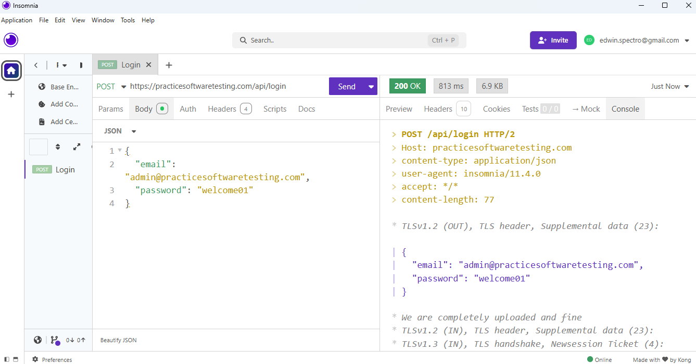

*Por: Edwin Ajahuanca Callisaya*

**Ejecutar TC-RF-LG-01:**
```
dotnet test --filter "ClassName=LoginTestExitoUsuarioValido" 
```
Resultado:
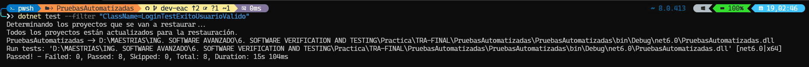

*Por: Edwin Ajahuanca Callisaya*

**Ejecutar TC-RF-LG-02:**
```
dotnet test --filter "ClassName=LoginTestFallidoContrasenaIncorrecta" 
```
Resultado:
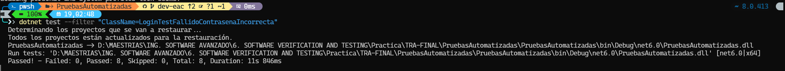

*Por: Edwin Ajahuanca Callisaya*

**Ejecutar TC-RF-LG-03:**
```
dotnet test --filter "ClassName=LoginTestFallidoUsuarioInexistente" 
```
Resultado:
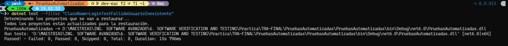

*Por: Edwin Ajahuanca Callisaya*

**Ejecutar TC-RNF-LG-03:**
```
dotnet test --filter "ClassName=LoginTestUsuarioValidoPlaywright" 
```
Resultado:
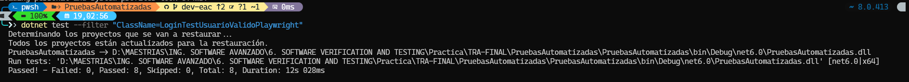

*Por: Edwin Ajahuanca Callisaya*

**Ejecutar TC-RF-LG-04:**
```
dotnet test --filter "ClassName=LoginTestValidacionCamposObligatorios" 
```
Resultado:
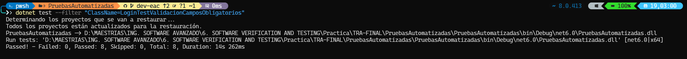

*Por: Edwin Ajahuanca Callisaya*

**Ejecutar TC-RNF-LG-01:**
```
dotnet test --filter "ClassName=LoginTestValidacionEmail" 
```
Resultado:
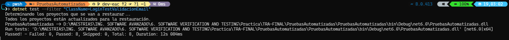

*Por: Edwin Ajahuanca Callisaya*

**Ejecutar TC-RNF-LG-01:**
```
dotnet test --filter "ClassName=LoginTestValidacionLongitudPassword" 
```
Resultado:
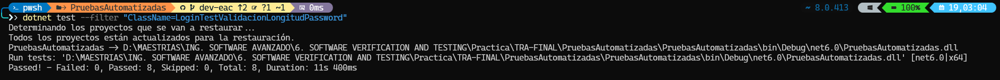

*Por: Edwin Ajahuanca Callisaya*

**JMeter - Test Plain - Prueba de concurrencia de usuarios. TC-RNF-LG-01**
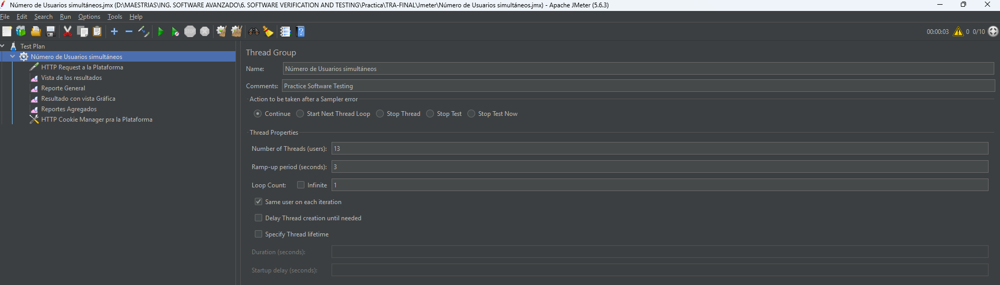
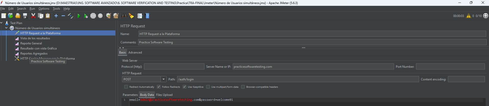
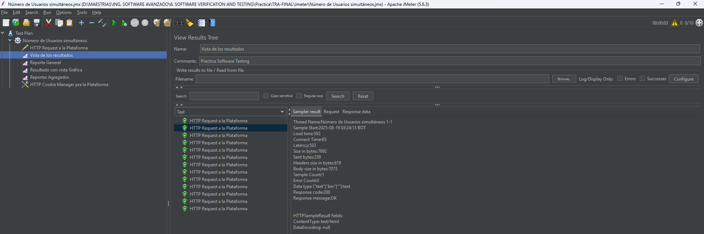
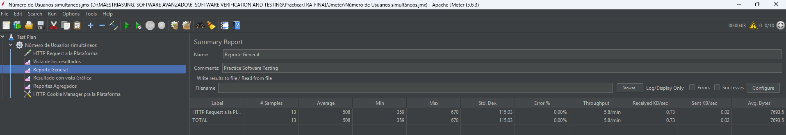
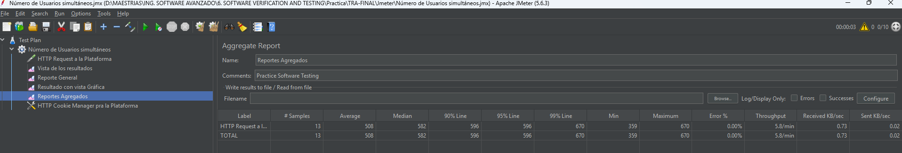

*Por: Edwin Ajahuanca Callisaya*

### Nota
- Esta documentación resume los requisitos, casos de prueba y guía de automatización.  
- Para detalles completos de cada escenario, mensajes exactos y pasos de ejecución manual, ver plan de pruebas completo en el informe final.
